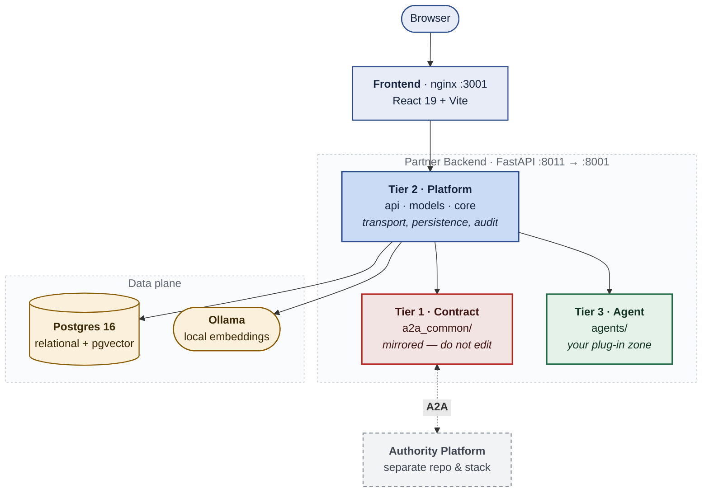

<h1 align="center">Partner Platform</h1>

<p align="center">
  Reference base code for ecosystem partners — receive specification changes
  from an Authority over the A2A protocol, assess them against your own
  capability profile, negotiate terms, and report readiness — with a
  <strong>pluggable agent at every stage</strong> that you replace with your own.
</p>

<p align="center">

[](https://www.python.org)
[](https://fastapi.tiangolo.com)
[](https://react.dev)
[](https://vite.dev)
[](https://www.postgresql.org)
[](https://github.com/a2aproject/a2a-python)
[](https://docs.docker.com/compose/)
[](LICENSE)
[](DCO.md)
[](CONTRIBUTING.md)

</p>

---

## Overview

This is the **receiving side** of a specification change. A central Authority
publishes a change; every bank, payment service provider and third-party app
provider in the ecosystem has to read it, work out what it costs them, ask
questions, build it, and declare themselves ready. This platform does that side
of the conversation.

It is **reference base code, not a product**. Fork it, point it at your
Authority, and replace the agent bodies with logic that knows your systems.

- 📥 **Change inbox over A2A** — change communications arrive from the Authority
  with the full Product Kit (BRD, technical spec, FAQ, test cases) attached
- 🧭 **Feasibility assessment** — each change is scored against your own
  capability profile, so the answer reflects your estate rather than a generic one
- 💬 **Query and negotiation loop** — ask the Authority questions, accept or
  counter rollout terms, and track the round until it freezes
- 📊 **Progress and readiness** — report Design → Coding → Testing and declare
  ready for certification
- 🔌 **Pluggable agents** — every stage is an agent you can swap: shipped Python
  class, an HTTP service you host, or (designed-for) an MCP server
- 🧠 **Retrieval over your own code** — ingest your repository into pgvector so
  an agent's assessment cites files it actually read
- 🔐 **Signed A2A wire** — Bearer JWT plus an HMAC envelope, verified with a
  constant-time compare inside a 5-minute timestamp window

> [!IMPORTANT]
> This platform is a **client** of a live Authority instance. It needs a
> reachable Authority A2A endpoint plus Authority-issued credentials, set from
> the Settings UI. It is not a standalone server.

### Domain support

The wire contract carries payments-ecosystem field names (`npci_change_id` and
similar) because they are shared with the Authority platform and cannot be
renamed on one side alone. **User-visible wording is not fixed**: labels default
to neutral text — "the Authority" rather than any named organisation — and are
overridden per deployment through `VITE_LABEL_OVERRIDES`. See
[`TRADEMARKS.md`](TRADEMARKS.md).

---

## Architecture

Three services in the default stack, and a one-way dependency rule that is the
whole point of the design:



**The three tiers**, and why the boundary matters:

| Tier | Path | Yours to edit? |
|---|---|---|
| **1 — Contract** | `app/a2a_common/` | **No.** Mirrored with the Authority platform; `hmac_signer.py` must stay byte-identical on both sides |
| **2 — Platform** | `api/` · `models` · `database` · `core/llm` · frontend | Rarely. Transport, persistence, UI |
| **3 — Agent** | `app/agents/` | **Yes — this is your plug-in zone** |

Dependency direction is one-way: Platform → Agent (through the registry) and
Platform → Contract. The agent tier receives plain dicts and returns plain dicts
— no DB or ORM object crosses the boundary, which is what keeps your agent
decoupled and testable.

The Authority platform — the sending side of every change — lives in its own
repository and runs as its own stack:
<https://github.com/npci/atom-network-platform>.

> [!WARNING]
> `app/a2a_common/` is **mirrored** between the two repositories, and each
> repository's CI validates only its own copy. Nothing checks the two against
> each other, so a signing change must land on both sides as a coordinated
> release. Skip that and both test suites still pass — the first symptom is a
> rejected signature on a live A2A call.

---

## Prerequisites

### Required software

- **Docker** with **Compose v2** — the supported way to run the full stack
- Alternatively Python 3.12+ and Node 20+ to run the services directly

### Required credentials

- **Nothing, to start.** With no LLM key the feasibility agent returns mock
  output, so the stack works end to end on a fresh clone.
- **`SESSION_JWT_SECRET`** must be set per deployment. It has no safe default.
- **To talk to a real Authority:** the platform URL, your partner API key, and
  the JWT/HMAC secrets issued during onboarding. These are entered in the
  Settings UI, never committed.
- **To use real agents:** one of `PARTNER_ANTHROPIC_API_KEY`,
  `PARTNER_OPENAI_API_KEY`, or `PARTNER_AINXT_API_KEY`.

---

## Quick Start

**1. Clone and start**

```bash
git clone https://github.com/npci/atom-partner-platform
cd atom-partner-platform

# TLS — the edge proxy refuses to start without a cert pair.
# Self-signed is fine for local dev; use a real one anywhere else.
mkdir -p deploy/tls
openssl req -x509 -newkey rsa:2048 -nodes -days 365 \
  -keyout deploy/tls/key.pem -out deploy/tls/cert.pem -subj "/CN=localhost"

cp backend/.env.example backend/.env     # set SESSION_JWT_SECRET and PARTNER_SECRET_KEK
docker compose up -d
```

This brings up Postgres with pgvector, Ollama, the backend, the frontend and the
`edge` proxy. The seven agents run in-process.

**Everything is reached through `edge`.** The backend and frontend are not
published to the host — the proxy is the single front door, and it terminates
TLS.

**2. Add an LLM key** (optional — skip for a mock-output loop)

```bash
# backend/.env
LLM_PROVIDER=claude                      # claude | openai | ainxt
PARTNER_ANTHROPIC_API_KEY=sk-ant-...
```

```bash
docker compose restart backend
```

**3. Open the app**

| App | URL |
|---|---|
| Partner Platform | <https://localhost:8443/a2a-partner/> |
| Agent Card | <https://localhost:8443/.well-known/agent-card.json> |

Self-signed certificate, so the browser warns once — expected for local dev.
Override the ports with `PARTNER_EDGE_HTTPS_PORT` / `PARTNER_EDGE_HTTP_PORT`.

**4. Log in and connect to your Authority**

Default admin: `admin` / `Admin@1234`.

> [!CAUTION]
> **Change the seeded password immediately.** This default is published in this
> README and in the deployment guide, so it is public knowledge. Rotate it
> before the service is reachable by anyone else.

Then open **Settings** and enter the Authority Platform URL, your Partner API
Key, the Authority JWT / HMAC secrets, and your Partner Name. Click **Test
Connection**, then **Save**.

**5. Run the tests**

```bash
docker compose run --rm backend pytest
```

---

## Features

| Feature | Description |
|---------|-------------|
| **Change Inbox** | Receive feature change notifications from the Authority with the full Product Kit |
| **Product Kit Viewer** | View and download the kit docs (BRD, Tech Spec, FAQ, test cases, …) |
| **Feasibility** | Auto-assessment of each change against your capability profile (pluggable agent) |
| **Query / Negotiation** | Ask the Authority questions, accept or counter rollout terms |
| **Progress & Readiness** | Report Design → Coding → Testing, declare ready for certification |
| **Code repository RAG** | Ingest your own repo into pgvector so assessments cite real files |
| **Agent framework** | Plug in your own agents — in-process code, or a service you host |

### The shipped agents

Seven agents are wired in `backend/config/agents.yaml`. They are **reference
implementations**: `feasibility` carries real logic, and the rest return
documented mock output so the flow is complete on a fresh clone. Replacing them
is the intended use of this repository.

| Agent | Binding | Status |
|---|---|---|
| `feasibility` | `app.agents.feasibility:FeasibilityAgent` | **Real** logic; mock report when no LLM key is set |
| `design` | `app.agents.design:DesignAgent` | Stub — documented mock output |
| `code` | `app.agents.code:CodeAgent` | Stub |
| `test` | `app.agents.testing:TestAgent` | Stub |
| `negotiation` | `app.agents.negotiation:NegotiationAgent` | Stub |
| `code_reviewer` | `app.agents.code_reviewer:CodeReviewerAgent` | Review lens — any finding blocks the merge request |
| `security_reviewer` | `app.agents.security_reviewer:SecurityReviewerAgent` | Review lens — any finding blocks the merge request |

Swapping an agent for a service you host is a **one-line change**, with no code
edit:

```yaml
# backend/config/agents.yaml
code:
  url: https://your-host/agents/code
  auth: bearer            # token from $AGENT_SERVICE_TOKEN
  timeout_s: 30
  retries: 2
```

Every run — in-process or remote — writes an audit row to `agent_runs`.

---

## A2A protocol surface

- **Agent Card:** `GET /.well-known/agent-card.json`
- **JSON-RPC:** `POST /a2a-rpc/rpc` — the Authority sends `change_communication`
  and `clarification_response`; the partner sends `query`, `progress` and
  `readiness`
- **Auth:** Bearer JWT signed by the Authority, plus an HMAC envelope validated
  by the Tier-1 middleware

---

## Project Structure

```
backend/
  app/a2a_common/       TIER 1 — A2A wire contract. Mirrored with the Authority. Do not edit.
  app/agents/           TIER 3 — YOUR plug-in zone: agents + externalised prompts
  app/agents/prompts/   Prompt text as .md, loaded not hardcoded
  app/api/dashboard/    Dashboard and workflow endpoints
  app/rag/              Code and document ingest, chunking, pgvector retrieval
  app/services/         GitLab merge-request integration, PDF sign-off
  config/agents.yaml    Agent manifest — bindings, prompts, per-agent model overrides
  requirements.lock     Hash-locked closure; this is what the image installs
frontend/src/           React 19 + Vite UI
data/                   Partner capability profile template and worked examples
docs/                   Plans and design records
```

### Related repositories

| Repository | What it is |
|---|---|
| [atom-network-platform](https://github.com/npci/atom-network-platform) | The sending side — the Authority's platform that authors changes and distributes them over A2A |

---

## Development

### Running without Docker

```bash
cd backend
python -m venv venv && . venv/bin/activate    # Windows: venv\Scripts\activate
pip install -r requirements.txt
# point DATABASE_URL at a reachable Postgres, set SESSION_JWT_SECRET, then:
uvicorn app.main:app --host 0.0.0.0 --port 8001 --reload
```

Frontend: `cd frontend && npm install && npm run dev`.

### Tests and lint

```bash
cd backend
pip install -r requirements.txt -r requirements-dev.txt
pytest                                   # agent-contract, handler, dashboard, e2e
ruff check .
```

> [!NOTE]
> Dependencies are **hash-locked**: the image installs from
> `requirements.lock` with `--require-hashes`, so editing `requirements.txt`
> alone changes nothing until the lock is regenerated. The command is in the
> lock's header.

- [`ARCHITECTURE.md`](ARCHITECTURE.md) — the three tiers, the agent contract,
  bindings, config/secret split, LLM key resolution, the audit table, prompt
  customisation, and a build-your-own-agent walkthrough
- [`DEPLOYMENT_GUIDE.md`](DEPLOYMENT_GUIDE.md) — deploying the stack
- [`frontend/DESIGN_SYSTEM.md`](frontend/DESIGN_SYSTEM.md) — UI conventions

### Key environment variables

See [`backend/.env.example`](backend/.env.example) for the full list.

| Variable | Purpose |
|----------|---------|
| `SESSION_JWT_SECRET` | Local login-session signing key — **set per deployment** |
| `DATABASE_URL` | Postgres connection string |
| `AGENTS_CONFIG` | Path to the agent manifest (`config/agents.yaml` by default) |
| `PARTNER_PROFILE_PATH` | Capability profile read by the feasibility agent |
| `LLM_PROVIDER` + `PARTNER_*_API_KEY` | LLM provider and key for in-process agents (optional) |
| `AGENT_SERVICE_TOKEN` | Bearer token for any agent configured with a remote `url:` |
| `VITE_BRAND_LOGO_URL` / `VITE_BRAND_NAME` | Deployment-supplied branding |
| `VITE_SAFE_REDIRECT_HOSTS` | Comma-separated hosts the UI may link out to. **Set this to your GitLab host** (e.g. `gitlab.example.com`), otherwise merge-request links render as `#` — see `frontend/src/utils/safeUrl.js` |

---

## Capabilities and Limits

Stated plainly, because a platform that generates code invites assumptions:

- **It does not deploy, and it does not merge.**
  `git_integrator.open_merge_request()` creates a branch, commits files and
  opens a merge request. Never merging is enforced in code — keep it that way in
  your fork.
- **Prompt injection is mitigated, not solved.** Change communications, Product
  Kit documents and retrieved code chunks are untrusted input that reaches a
  model. Treat every generated artifact as a proposal for human review. See
  [`SECURITY.md`](SECURITY.md).
- **Five of the seven agents are stubs.** That is by design — they are the parts
  you replace — but it means a fresh clone demonstrates the flow rather than
  performing real work.
- **The backend is single-instance as it stands.** Login lockout and the JWT
  denylist are in-memory, so a second replica would not share either.
- **The dependency lock has drifted from `requirements.txt`**, and the image
  installs from the lock. Regenerate it before any release — see
  [`THIRD-PARTY-NOTICES.md`](THIRD-PARTY-NOTICES.md).

---

## Troubleshooting

| Symptom | Cause and fix |
|---|---|
| Every AI feature returns mock output | No LLM key set. See Quick Start step 2. |
| `PARTNER_ANTHROPIC_API_KEY not set` | `LLM_PROVIDER=claude` with no matching key. Set the key for the provider you selected. |
| A2A calls rejected with a signature error | The Authority's HMAC secret does not match, or the two sides' `hmac_signer.py` have diverged. Re-check Settings first. |
| `timestamp_skew` on inbound A2A | Clock drift beyond the 5-minute window. Sync NTP on both sides. |
| Login returns 429 | Brute-force lockout: 5 failures → 60s, 10 → 5 min. Wait it out; there is no CAPTCHA to solve. |
| Retrieval scores 0 for everything | The corpus is empty, or the embedding model was never pulled: `docker exec partner_ollama ollama pull nomic-embed-text`. |
| `pip ... hashes do not match` on build | The lockfile is stale. Regenerate it — the command is in the lock's header. |
| A `backend/app/**` edit has no effect | `app/` is baked into the image. Rebuild, or add a bind mount. |

---

## Branding

No third-party logo or mark is bundled. Set `VITE_BRAND_LOGO_URL` and
`VITE_BRAND_NAME` to your own; unset, the UI renders a neutral text wordmark and
refers to "the Authority" rather than any named organisation. See
[`TRADEMARKS.md`](TRADEMARKS.md).

---

## Documentation

| Document | What it covers |
|---|---|
| [`FAQ.md`](FAQ.md) | Why questions the Troubleshooting table does not answer |
| [`CHANGELOG.md`](CHANGELOG.md) | Release history |
| [`USER_GUIDE.md`](USER_GUIDE.md) | Using the platform, role by role, from idea to certification |
| [`DEPLOYMENT_GUIDE.md`](DEPLOYMENT_GUIDE.md) | Installation, Docker and native |
| [`CONFIGURATION.md`](CONFIGURATION.md) | Every setting, which surface wins, and what blocks startup |
| [`ARCHITECTURE.md`](ARCHITECTURE.md) | The three tiers, the agent contract, build-your-own walkthrough |
| [`CONTRIBUTING.md`](CONTRIBUTING.md) | How to contribute, DCO sign-off, coding standards |
| [`SECURITY.md`](SECURITY.md) | Reporting a vulnerability, and the security posture |
| [`wiki/`](wiki/) | Deep reference: the wire, the security layers, the data model, retrieval |

---

## Contributing

Contributions are welcome, under the [Developer Certificate of Origin](DCO.md) —
no CLA, just `git commit -s`.

Because this is reference base code, the line between upstream and your fork
matters: the platform, the A2A contract and the agent **framework** are
upstream's; agent **bodies**, prompts and capability profiles are yours.

- [CONTRIBUTING.md](CONTRIBUTING.md) — how to get started, commit guidelines,
  DCO sign-off, coding standards, and what belongs upstream
- [CODE_OF_CONDUCT.md](CODE_OF_CONDUCT.md) — our community standards
- [GOVERNANCE.md](GOVERNANCE.md) — how decisions are made and who the
  maintainers are
- [SECURITY.md](SECURITY.md) — how to report a vulnerability
- [SUPPORT.md](SUPPORT.md) — where to ask which question

---

## Licence

MIT License — see [`LICENSE`](LICENSE).

[`NOTICE`](NOTICE) is not required by MIT and is kept anyway: it is where this
project discharges the attribution its own dependencies require.

Third-party dependency licensing, including the copyleft position, is set out in
[`THIRD-PARTY-NOTICES.md`](THIRD-PARTY-NOTICES.md). No GPL or AGPL package
appears in either the Python or the Node closure.

The licence covers code, not trademarks: see [`TRADEMARKS.md`](TRADEMARKS.md).

---

## Governance

The Partner Platform is a single-vendor open-source project sponsored by the
National Payments Corporation of India (NPCI), maintained by the same team as
the Authority platform. See [GOVERNANCE.md](GOVERNANCE.md) for the full
governance model, maintainer list, and decision-making process.
