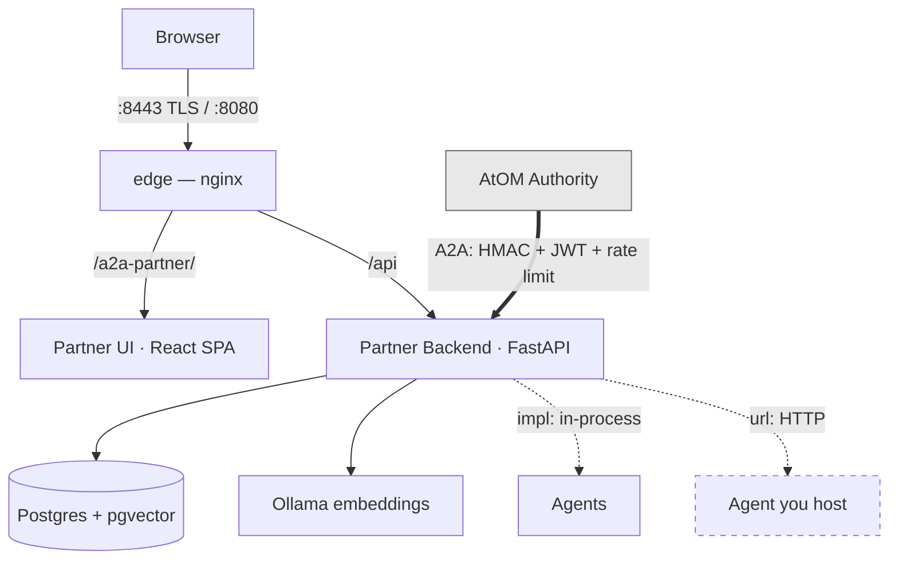

# Partner Platform Wiki

Detailed reference for the architecture, the components, and the code.

This renders natively on GitHub — plain GitHub-flavoured markdown and mermaid,
no site build, no separate wiki repository. It lives in the main repo so a
documentation change ships in the same pull request as the code change it
describes.

## How this is organised

Pages fall into two kinds here, and the difference matters when you edit one.

| Kind | What it is | Editing rule |
|---|---|---|
| **Explanation** | Hand-written narrative | Edit freely; carries a verified-at stamp |
| **Canonical elsewhere** | Already documented in the repo | Link to it; never copy it here |

The second rule is the one that gets broken. Copying a section here creates a
second version that disagrees with the first the next time either changes. This
repository has already demonstrated the failure twice: `ARCHITECTURE.md` headed
a table "The five shipped agents" while the manifest listed seven, and
`USER_GUIDE.md` described six working agents as mock stubs. Both were true when
written. When something is already written down, link to it.

**There is no generated Reference section.** The Authority repository generates
its agent catalogue, HTTP API and data model by introspecting a running
application. That generator is not part of this repository, so every page here
is hand-written and stamped rather than derived. The
[data model](data-model.md) page states this consequence plainly: the table
list is a snapshot, not a projection.

## Architecture at a glance

**`edge` is the only published port.** The backend and frontend are deliberately
unpublished — they are reachable through the proxy or not at all. A guide that
tells you to open `localhost:3001` or `localhost:8011` is describing a *native*
install, not the Docker one.

The Authority arrow is one-way into this stack for delivery, but the platform
calls back out to the Authority for every reply — see
[the A2A wire](a2a-wire.md).

## Explanation (hand-written)

| Page | What it covers |
|---|---|
| [Architecture](architecture.md) | The stack, the request path, and what runs in the background |
| [The A2A wire](a2a-wire.md) | The protocol from the receiving side, the vendored copies, and the mistakes |
| [Security layers](security-layers.md) | What an inbound call passes through, in order, and how to read a rejection |
| [Change lifecycle](change-lifecycle.md) | What arrives, what goes back, and the two independent state tracks |
| [Data model](data-model.md) | 21 tables, no migration tool, and what that costs you |
| [Retrieval](retrieval.md) | How documents and code are ingested and searched |

Each carries a **verified-at** stamp naming the commit it was checked against.
When the stamp no longer matches the tree, distrust the page — that is what the
stamp is for.

Because this repository has **no migration tool**, the stamp cannot name a
schema version the way the Authority's pages name an alembic head. It names the
commit and, where the page depends on the schema, the table count. See
[data model](data-model.md).

## Already canonical — start here

| Document | Why you would open it |
|---|---|
| [`../ARCHITECTURE.md`](../ARCHITECTURE.md) | **The agent contract.** Bindings, prompts, and the build-your-own walkthrough |
| [`../README.md`](../README.md) | Project overview, features, quick start |
| [`../DEPLOYMENT_GUIDE.md`](../DEPLOYMENT_GUIDE.md) | Installing and running, Docker and native |
| [`../USER_GUIDE.md`](../USER_GUIDE.md) | The platform from the operator's chair |
| [`../FAQ.md`](../FAQ.md) | Common questions, especially about forking |

**`ARCHITECTURE.md` owns the agent contract.** It is the single most important
document in this repository, because replacing the shipped agents is the
intended use of the fork. No page here re-explains bindings — they link to it.

## Related repositories

| Repository | Why you would open it |
|---|---|
| [atom-network-platform](https://github.com/npci/atom-network-platform) | The Authority. Separate repository and stack — this wiki does not describe it |

## Scope limits

This wiki describes the **platform**, not the reference agents' internal
reasoning. The agents are the part you are expected to replace; documenting
their prompt-level behaviour in depth would describe code that is meant to be
deleted.
