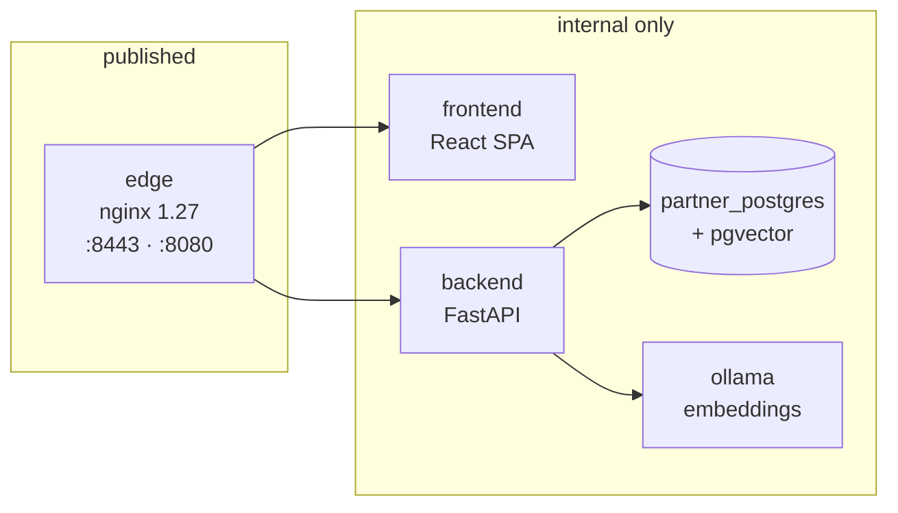

# Architecture

> **Verified at:** commit `0a72eb1`, 2026-09-03. Services counted in
> `docker-compose.yml`; routers in `backend/app/main.py`; module inventory
> under `backend/app/`.
>
> For the **agent contract** — bindings, prompts, hosting your own — see
> [`../ARCHITECTURE.md`](../ARCHITECTURE.md). This page is the stack around it.

## What this platform is

The receiving half of a two-party system. The Authority
([AtOM](https://github.com/npci/atom-network-platform)) publishes a
specification change; this platform receives it, runs *your* agents over it,
tracks the work, carries your replies back, and drives certification.

It is designed to be **forked**. The shipped agents are reference
implementations, and the seam between "the platform" and "your logic" is a
manifest entry rather than a code edit.

## Three tiers

The repository divides into three zones with different rules about what you may
change. [`../ARCHITECTURE.md`](../ARCHITECTURE.md) is canonical for this; the
short version:

| Tier | Where | Rule |
|---|---|---|
| **Contract** | `backend/app/a2a_common/` | Mirrored from the Authority. Do not edit — see [the A2A wire](a2a-wire.md) |
| **Platform** | `backend/app/{api,core,services,rag}/` | The orchestration. Edit if you must; you own the merge |
| **Agent** | `backend/app/agents/`, `backend/config/agents.yaml` | **The plug-in zone.** Yours |

The tiers are a maintenance prediction, not an access control. Nothing stops
you editing the contract tier — but the next sync from the Authority will
overwrite it, and a divergent wire fails as an authentication error on the
*other* side of the boundary.

## The stack



Five services. **Only `edge` publishes a port** — `8443` for TLS and `8080`
for plain HTTP, both configurable via `PARTNER_EDGE_HTTPS_PORT` and
`PARTNER_EDGE_HTTP_PORT`. The backend's `ports:` block exists but is commented
out, and the comment says why: publishing it once exposed the operator UI login
alongside the A2A ingress on the same unauthenticated surface.

`edge` mounts `deploy/tls/{cert,key}.pem` read-only and **will not start
without them**. On a clean clone you generate a self-signed pair before the
first `docker compose up`. This is the single most common first-run failure.

## The request path

Everything the browser sees is served under the `/a2a-partner/` prefix. The
A2A ingress is not — it is mounted at `/a2a-rpc/rpc`, and the agent card is
served **unprefixed at the root**, because a remote agent fetches the card
without knowing anything about local path layout.

Six routers are mounted on the main app:

| Router | Covers |
|---|---|
| `auth` | Login and session |
| `dashboard` | The bulk of the product — 16 modules |
| `feasibility` | The feasibility assessment path |
| `users` | Account management |
| `integration_testing` | The reverse tunnel's ingress |
| `integration_testing_admin` | Operator control for the tunnel |

`integration_testing` is registered **unconditionally** but hard-disabled
unless `integration_testing_enabled` is set, which production config refuses.
Mounting it either way keeps the route table the same shape in every
environment — a config flip changes behaviour, not the surface, so a route
that 404s in one environment and answers in another cannot surprise you.

`dashboard` is a package rather than a module, and its 16 members map closely
onto the screens in [`../USER_GUIDE.md`](../USER_GUIDE.md): `changes`, `design`,
`code`, `code_repo`, `testing`, `certification`, `defects`, `queries`, `drafts`,
`decision`, `progress`, `knowledge`, `profile`, `settings`, `jobs`, and a
`_shared` helper module.

## The A2A mount is optional at import time

The whole A2A subsystem is lazy-imported inside a `try`, and a failure logs a
warning rather than stopping the process:

```python
except Exception as _a2a_import_err:
    logger.warning("a2a-sdk not importable; skipping /a2a-rpc mount", ...)
```

That is deliberate — a partner stack must boot and serve its own UI even before
the Authority has flipped it over to the SDK path. **The cost is that a broken
A2A mount looks like a healthy platform.** The backend answers, the UI works,
and inbound changes silently never arrive. If deliveries stop, check the startup
log for that warning before looking anywhere else.

## Background work

There is no Celery, no worker container, and no message broker. Two schedulers
run in-process:

| Scheduler | Module | What it does |
|---|---|---|
| Outbound retry | `services/outbound_retry_scheduler.py` | Re-attempts A2A messages that failed to send |
| Retention | `services/retention_scheduler.py` | Applies data-retention policy |

**Outbound delivery assumes failure.** A message that fails is written to
`outbound_a2a_retries` and retried by the scheduler, not by the request that
first attempted it. A reply that has not reached the Authority yet is usually in
that table rather than lost — query it before assuming a protocol fault.

Agent work runs through `agent_jobs` rather than blocking a request. That is
what lets a long feasibility assessment survive the browser tab closing.

## Where the LLM sits

`core/llm.py` resolves provider and model, with three providers supported
(`anthropic`, `openai`, `ainxt`). Resolution order and per-agent overrides are
documented in [`../ARCHITECTURE.md`](../ARCHITECTURE.md#llm-keys--model-resolution).

Two guards sit around it. `core/llm_budget.py` bounds spend, and
`core/secret_box.py` encrypts every stored key at rest — the platform refuses to
save a secret before an encryption key is configured rather than writing it in
the clear.

**Every agent degrades to labelled mock output when no key is configured.** A
fresh clone produces a complete end-to-end flow with no credentials at all. Mock
output carries `_meta.mock = true` and says so in its text, so it cannot be
mistaken for a real assessment.

## Related

- The agent contract and how to replace an agent: [`../ARCHITECTURE.md`](../ARCHITECTURE.md)
- What crosses the boundary: [the A2A wire](a2a-wire.md)
- What guards it: [security layers](security-layers.md)
- What the tables hold: [data model](data-model.md)
