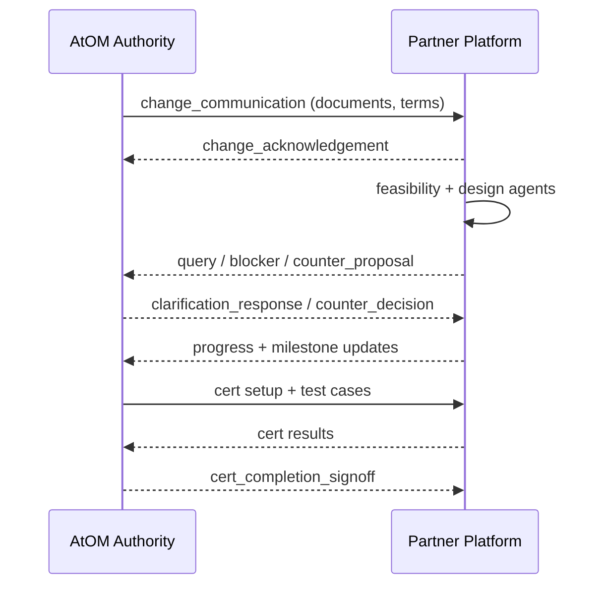

# Change lifecycle

> **Verified at:** commit `4d4999c`, 2026-09-03. States read from
> `backend/app/models.py` (`IncomingChange`); handlers from
> `backend/app/a2a_common/handlers/`.
>
> For the same flow from the operator's chair, see
> [`../USER_GUIDE.md`](../USER_GUIDE.md). This page is the mechanism.

## Two independent tracks

A change carries **two** status fields that are easy to conflate, and keeping
them separate is the point:

| Field | Values | Answers |
|---|---|---|
| `status` | `received` → … → `certified` | Where the assignment is in the Authority's lifecycle |
| `decision` | `pending`, `acknowledged`, `accepted`, `negotiating` | What this partner has decided about the rollout terms |

Plus a third, coarser track reported independently: **design complete**,
**coding complete**, **testing complete**, held in `progress_reports`.

Three tracks sounds like over-modelling until you need to say *"we are in
progress, we have not accepted the dates, and design is done."* One field cannot
carry that, and collapsing it forces a partner to imply a commitment they have
not made.

## The assignment lifecycle

```
assigned → communicated → acknowledged → in_progress → ready
  → received → accepted → applied → tested
  → ready_for_certification → certifying → certified
```

Twelve states, visible to the Authority. Each partner's assignment advances
independently, so one slow partner does not block another.

`decision` defaults to `pending` and auto-acknowledgement flips it to
`acknowledged` — so an unattended platform still answers, and the Authority is
never left waiting on a receipt because nobody was at a desk.

## What arrives



Inbound messages dispatch to handlers under `a2a_common/handlers/` — the full
table is in [the A2A wire](a2a-wire.md#what-arrives-and-what-handles-it).

`change_communication` is the entry point. It carries the documents, which land
in `change_documents`, and the Authority's per-`(change, partner)`
`correlation_id`, which is captured on the `IncomingChange` row and **echoed
back on every reply about that change**. That is what threads your replies to
the right conversation on the Authority's side; losing it does not fail loudly,
it just makes your replies look unrelated.

## What goes back

Four things, each with its own shape:

| Reply | Table | Shape |
|---|---|---|
| **Query** | `outgoing_queries` | A question, answered on the record |
| **Blocker** | `IncomingChange.blockers` (append-only JSON) | Severity + status of its own |
| **Counter-proposal** | `npci_counter_history`, `counter_decisions` | Round-based, append-only |
| **Progress** | `progress_reports` | Coarse milestones |

**The negotiation history is append-only on purpose.** `npci_counter` holds the
*active* counter and is cleared to `NULL` when answered; `npci_counter_history`
keeps every counter with how it was resolved, and `counter_decisions` keeps the
Authority's accept/reject responses. The UI reads history rather than the active
field, so past rounds stay visible after the live card is dismissed. The model
comment names the reason: **non-repudiation in multi-round negotiation**. A
design that overwrote the active counter would leave both sides unable to prove
what was proposed when.

Blockers are append-only for the same reason, each carrying
`{severity, description, impact, options_considered, requested_action_from_npci}`
plus the resolution when it arrives.

## Negotiation closes on a timer

Rounds open and close on the Authority's schedule — `round_opened` and
`round_closed` arrive as messages, and `negotiation_frozen` ends the exchange.

**If a round closes with no response, silence is recorded as agreement.** The
Authority applies silent acceptance. This is the one place in the whole system
where doing nothing produces a binding outcome, and it is the mechanism most
worth understanding before going live.

## Certification

Driven by `cert_lifecycle`, with results arriving per case via
`cert_test_response` and closure via `cert_completion_signoff`.

**A case with no test data is reported as not ready, not filled with
defaults.** Gaps come back marked `ready=false` with a reason rather than being
certified against numbers nobody chose — a green certification against invented
data is worse than an honest gap.

Rounds repeat until zero failures, stopping on success, a round cap, or **two
consecutive identically-failing rounds** — two identical rounds mean the fix
changed nothing, and a third will not either.

A human at the partner approves the round close before the Authority is told
you are ready. That gate is not automated away.

`services/cert_signoff_pdf.py` produces the sign-off document.

## Where the agents attach

Agent work runs as `agent_jobs` rows rather than inline in a request, writing
into `feasibility_reports`, `design_reports`, `code_reports`, `test_reports` and
`code_review_reports`. Every run is audited in `agent_runs`.

The review step is the one with teeth: **any finding from either
`code_reviewer` or `security_reviewer` blocks the merge request**, and the
generating agent cannot clear its own findings.

Read [`../ARCHITECTURE.md`](../ARCHITECTURE.md#scope-of-the-automated-code-review-gate)
before relying on that gate — it does not generate or run tests, and its scope
is stated there precisely so nobody reads more into a clean review than it
claims.

## Related

- The protocol underneath: [the A2A wire](a2a-wire.md)
- The tables named here: [data model](data-model.md)
- The agent contract: [`../ARCHITECTURE.md`](../ARCHITECTURE.md)
