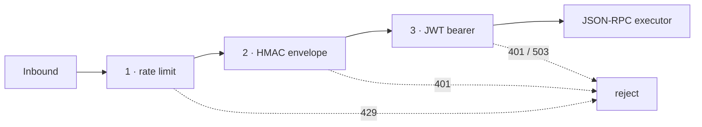

# Security layers

> **Verified at:** commit `4d4999c`, 2026-09-03. Nesting order read from
> `backend/app/a2a_common/mount.py`; escape-hatch behaviour from
> `backend/app/config.py` and `backend/app/core/security_events.py`.
>
> For the protocol these layers guard, see [the A2A wire](a2a-wire.md).

## What an inbound A2A call passes through

Middleware is nested **cheapest first**, so a flood is rejected before anything
computes a signature and a bad signature is rejected before anything decodes a
token.



| # | Layer | Module | Rejects |
|---|---|---|---|
| 1 | Rate limit | `rate_limit_middleware.py` | Too many requests per second |
| 2 | HMAC envelope | `hmac_middleware.py` | Bad or absent `X-NPCI-Signature`, or a timestamp outside the window |
| 3 | Bearer JWT | `auth_middleware.py` | Bad signature, wrong claim shape, or **no secret configured** |

Outside the A2A mount, three more apply to the whole application: CORS, HSTS,
and `MaxBodySizeMiddleware` bounding request bodies at
`a2a_max_request_body_bytes`. The HMAC layer applies its own stricter,
streaming-aware limit, because it must buffer the body to verify it.

The HMAC layer wraps **outside** JWT deliberately: the body buffer has to happen
before the token decode, or the decode consumes a stream the verifier still
needs.

## Fail-closed is the default

**A missing secret rejects rather than bypasses.** If
`partner_settings.npci_jwt_secret` is absent, the middleware answers `503` to
inbound A2A calls. The same holds for `npci_hmac_secret`.

That is worth stating plainly because the intuitive alternative — "no secret
configured, so skip the check" — is how an ingress ends up unauthenticated in
production without anyone changing a line of security code.

One escape hatch preserves the old fail-open behaviour:

```
PARTNER_ALLOW_UNAUTHENTICATED_A2A=true
```

**It is inert outside development.** `allow_unconfigured_bypass()` returns
`False` in any protected environment regardless of the flag, and `config.py`
raises at import time rather than starting a process that would have been
unsafe. Setting it in production does not weaken the platform — it stops it,
which is the intended outcome. When it is set and ignored, a security event is
emitted saying exactly that, so the discrepancy is visible rather than silent.

## What is deliberately weaker here than at the Authority

This stack's middleware is a lighter mirror of the Authority's, and the
reductions are choices with stated reasons:

| Reduction | Why | What it costs |
|---|---|---|
| No session-revocation lookup | Revocation is centralised at the issuer, which mints the JWTs | A revoked token stays valid here until it expires |
| No partner-registry lookup | This stack receives from exactly one upstream, so the secret is global per-stack | None in the single-upstream case; the design breaks if that stops being true |
| **No Redis nonce store** | Most partner deployments do not run Redis | **Replay defence rests on the five-minute timestamp window alone** |

The third is the one to weigh before deploying. A captured, correctly-signed
message can be replayed within its window. The module notes the hook —
`_REDIS_GETTER` — for a deployment that does have Redis available.

## Rate limiting across replicas

The rate limiter is backed by Redis when `partner_rate_limit_redis_url` is
configured, so a limit means the same thing across replicas. Without it, each
process counts on its own and the effective limit multiplies by replica count.

**On a Redis outage it degrades to in-process counting rather than failing
open or failing shut.** That is the deliberate middle position: the limit gets
looser, not absent, and the platform keeps serving. `shared_limiter_configured()`
reports which mode is live — check it before trusting a limit in a multi-replica
deployment.

## Secrets at rest

`core/secret_box.py` encrypts every stored secret — the Authority JWT and HMAC
secrets, the partner API key, LLM keys, repository tokens. **The platform
refuses to store a secret before an encryption key is configured** rather than
writing it in the clear and warning.

`core/key_strength.py` checks key material rather than accepting anything
non-empty.

## Reading a rejection

Each layer fails differently on purpose. The distinction is the diagnostic:

| Symptom | Layer | Look at |
|---|---|---|
| `429` | Rate limit | Sender's send rate; whether Redis backing is configured |
| `401`, signature invalid | HMAC | Secret mismatch, or a vendored `hmac_signer.py` that has drifted from canonical |
| `401`, timestamp outside window | HMAC | **NTP on both hosts** — check this before reading code |
| `503` from the A2A mount | JWT | No `npci_jwt_secret` configured — onboarding is incomplete |
| `401`, token invalid | JWT | Secret rotated at the Authority and not shipped here |
| Nothing arrives, platform healthy | *No layer* | The mount failed to import — see [architecture](architecture.md#the-a2a-mount-is-optional-at-import-time) |

That last row is the one people lose a day to. A broken A2A mount does not
degrade the UI, so the platform looks fine while receiving nothing.

## Known documentation gap

Several modules cite architecture decision records — `docs/adr/ADR-0003-fail-closed-a2a-ingress.md`
and `docs/adr/ADR-0004-hostility-tier-registry.md` — that **are not present in
this repository**. The behaviour they describe is real and is implemented; the
records themselves did not come across in the split. Treat the module docstrings
as the authority until they are restored.

## Related

- The protocol these layers guard: [the A2A wire](a2a-wire.md)
- Where the boundary sits: [architecture](architecture.md)
- Reporting a vulnerability: [`../SECURITY.md`](../SECURITY.md)
